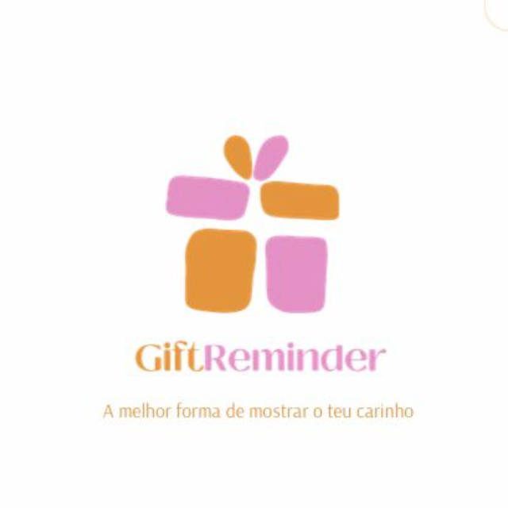

## Hi, I'm Dalton

<!--

  

-->

- 📚 **6th semester Software Engineering student** at PUCRS (2025/1)  
- 📊 **Business Analytics Intern** at [RCI - Analytics Intelligence](https://www.rciit.com)  
- 🔬 Former **Scientific Researcher** at [PET-Inf](https://petinfpucrs.github.io/)  
- 🎯 Interested in back-end development, infrastructure and AI-related topics  
- 📫 Reach me via [email](mailto:d.albeche@edu.pucrs.br)

 

## 🛠️ Languages and Tools

  
  

## Featured Projects
Click on any card below to see more details.
### 🎁 GiftReminder
<table>
  <tr>
    <td width="180px" align="center">
      
    </td>
    <td>
      

        <strong>GiftReminder</strong> is a mobile app designed to remind users of important events and recommend gifts through AI. Developed as part of <strong>AGES I</strong>, I contributed to the back-end using <strong>Python and FastAPI</strong>.
      

    </td>
  </tr>
</table>

### 🌌 Cosmos 
<table>
  <tr>
    <td width="180px" align="center">
      
    </td>
    <td>
      

        <strong>Cosmos</strong> is a responsive Web platform designed to foster a collaborative network of extension projects focused on improving access to justice for socioeconomically vulnerable populations. Presented to <strong>UN collaborators from New York</strong> and developed as part of <strong>AGES II</strong>, I contributed to the back-end using <strong>Node.js, NestJS, TypeScript, PostgreSQL, and Prisma</strong>
      

    </td>
  </tr>
</table>

## Contact me

  
  

